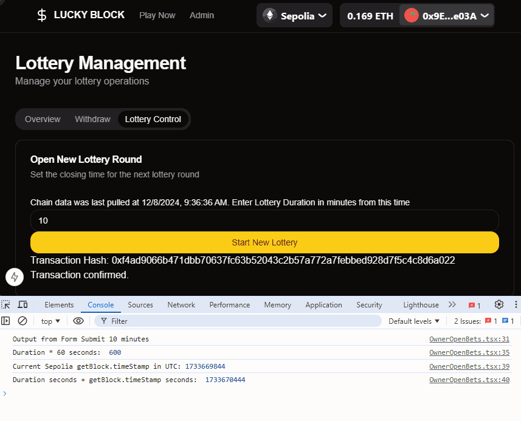

# HW 5 Extended to Final Project: Encode Club EVM Bootcamp Group 2 - Multichain Blockchain Lottery App


- Final Project: Encode Club EVM Bootcamp Group 2 - Multichain Blockchain Lottery App
  - [Contributing Team Members](#contributing-team-members)
  - [Overview](#overview)
  - [Demo](#demo)
  - [Opening Bet Screenshot](#opening-bet-screenshot)
  - [Sepolia Confirm of Opening Bet](#sepolia-confirm-of-opening-bet)
- [Smart Contract Deployment](#smart-contract-deployment)
  - [Verifying Deployed Contracts With Hardhat: `hardhat-verify` Plugin](#verifying-deployed-contracts-with-hardhat-hardhat-verify-plugin)
- [Key Learnings](#key-learnings)
  - [Embed Videos in GitHub README.md](#embed-videos-in-github-readmemd)
  - [Send Native Token to a Payable Function (wagmo v5.7.2+)](#send-native-token-to-a-payable-function-wagmo-v572)
  - [Multichain Deployment: Optimism Sepolia](#multichain-deployment-optimism-sepolia)
- [Install Instructions](#install-instructions)
  - [Install Steps](#install-steps)
- [Personal Notes: Bootstrapping Project](#personal-notes-bootstrapping-project)

## Contributing Team Members

* DAaJDn 
* Mn8EN0 
* XEGTvv  

## Overview

**NB: Encode Club suggested that we extend and further build out our Homework 5 submission as our final project!**

This project leverages learnings from the [Browser-based Voting App](https://github.com/codesport/erc20votes-part2). 


It is a web-based Lottery application which demonstrates the following **on-chain read-write functionalities** using wagmi/viem:

   * Buy/Return tokens
   * View/Place bets
   * Run lottery
   * Check lottery state
   * View/Claim prizes
   * Lottery admin
   * Bonus: Organize, document and optimize the smart contract

It terms of team responsibilities, there are 3-core parts:

1. Unit-testing [within hardhat](contracts/test/) 
2. UI and UX using Nextjs-React along with Tailwind and complemenatry CSS element libraries like shadcn.
3. Writing functional components using wagmi hooks for **on-chain read-write functions**


## Demo

 <video src="https://github.com/user-attachments/assets/6b0fd2f9-35e5-449e-95a9-846dc00dfd15"></video>

 
## Opening Bet Screenshot



## Sepolia Confirm of Opening Bet


# Smart Contract Deployment

The script used to deploy the contract is located here: https://github.com/codesport/blockchain-lottery/blob/master/contracts/scripts/02-deploy-lottery.ts


```

// npx ts-node scripts/02-deploy-lottery.ts

import { client, fs, contractAddressStoragePath, requestUserInput, readKeyValue, appendKeyValue, } from "./config";
import { abi as LottoABI, bytecode as LottoByteCode } from "../artifacts/contracts/Lottery.sol/Lottery.json";
import { parseEther } from "viem";


// TOKEN_RATIO = 2000 : 1 ==> 1 ETH = 2000 tokens  ==> 1 token = .0005 ETH

const MAXUINT256 =
    115792089237316195423570985008687907853269984665640564039457584007913129639935n;

const TOKEN_NAME = "Delta Lotto Token"
const SYMBOL = "DELTA"
const TOKEN_RATIO = 2000n; //this is a bigInt n is necessary!
const BET_PRICE = "10";  //Amount of tokens required for placing a bet that  goes for the prize pool
const BET_FEE = "0.2";

const main = async () => {

    const hash = await client.deployContract({
        abi: LottoABI,
        bytecode: LottoByteCode as `0x${string}`, // hexadecimal string, which is the standard format for Ethereum bytecode.
        args: [TOKEN_NAME, SYMBOL, TOKEN_RATIO, parseEther(BET_PRICE), parseEther(BET_FEE),],
    });

    console.log(`\nTransaction hash: ${hash}`);
    const receipt = await client.waitForTransactionReceipt({ hash });
    // const receipt = await publicClient.waitForTransactionReceipt({ hash: customnameTxHash });

    console.log("Lotto contract successfully deployed to:", receipt.contractAddress);
    //const LottoAddressToSave = { "lottoAddress": receipt.contractAddress }

    const tokenAddressToSave = await client.readContract({
        address: receipt.contractAddress as `0x${string}`,
        abi: LottoABI,
        functionName: 'paymentToken',
    })
    console.log(TOKEN_NAME, 'contract successfully deployed to:', tokenAddressToSave);


    const contactAddressesToSave = { "lottoAddress": receipt.contractAddress, "tokenAddress": tokenAddressToSave }

    fs.writeFileSync(contractAddressStoragePath, JSON.stringify(contactAddressesToSave));

}

main().catch((error) => {
    console.error(error);
    process.exitCode = 1;
});
```

## Verifying Deployed Contracts With Hardhat: `hardhat-verify` Plugin

* [Deployed and Verified Lotto Game Contract](https://sepolia.etherscan.io/address/0xb638eb5287c9378d779e397976cda76eb91a6836)
  
   

* [Deployed and Verified Delta ERC20 Token Contract](https://sepolia.etherscan.io/address/0x01515A57ca4D713272409FE16c3229C0C1ac81fb)


   


As per the [hardhat docs](https://hardhat.org/hardhat-runner/plugins/nomicfoundation-hardhat-verify#complex-arguments), configure `harhat.config`.ts and create a `arguments.ts` if working complex constructors. 


```
// arguments.ts
// c.f., https://hardhat.org/hardhat-runner/plugins/nomicfoundation-hardhat-verify#complex-arguments

import { parseEther } from "viem";

module.exports = [
    "Delta Lotto Token",
    "DELTA",
    2000n,   // uint256: 1 ETH = 2000 DELTA tokens.   1 DELTA = 1/2000 ETH = 0.0005 ETH
    parseEther("10"),  // uint256: 10 = Amount of tokens required for placing a bet that  goes for the prize pool
    parseEther("0.2"), // uint256: 20% = fee to protocol
]
```

Add one of the below to your hardhat config file depending if you're verifying a contract on one or multiple chains:

```
// Version 1 for single chain:  hardhat.config.ts
etherscan: {
    apiKey: ETHERSCAN_API_KEY
},
```

```
// Version 2 for multiple chains: hardhat.config
// npx hardhat verify --list-networks
  etherscan: {
    apiKey: {
        sepolia: "YOUR_ETHERSCAN_API_KEY",
        baseSepolia: "YOUR_ETHERSCAN_API_KEY",
        arbitrumSepolia: "YOUR_ETHERSCAN_API_KEY",
        optimismSepolia: "YOUR_ETHERSCAN_API_KEY",
    }
  }
```

Then run:

`npx hardhat verify 0xb638eb5287c9378d779e397976cda76eb91a6836 --network sepolia  --constructor-args arguments.ts`

For simple contructors, do the following:

`npx hardhat verify 0x01515A57ca4D713272409FE16c3229C0C1ac81fb --network sepolia  "Delta Lotto Token" "DELTA"`

# Attempting To Bet

Unfortunately, we were not able to successfully place a bet with our wallet due to high gas and not enough funds (faucets we previously used also seemed to not work). Interestingly enough, gas fees were way higher on Etherscan than through the local app. Almost 1 Sepolia ETH difference in gas. 

   

You can see the reverted transactions [here on Etherscan](https://sepolia.etherscan.io/address/0xb638eb5287c9378d779e397976cda76eb91a6836).

# Key Learnings

## Embed Videos in GitHub README.md

> 1. Open an issue on your repository. Don't save this issue.
> 2. Drag the .mp4 file into the issue editor. This creates an asset in your repo and returns the URL.
> 3. Copy the URL from the issue editor. Use this URL in the README.
>
> This also works in a README.rst like this:
```
.. raw:: html

    <video src="URL"></video>
```

source attribution: [Marcello Parathoner](https://github.com/orgs/community/discussions/19403#discussioncomment-8432916)

## Send Native Token to a Payable Function (wagmo v5.7.2+)

```
import { useWriteContract } from "wagmi";

const { data: hash, error, isPending, writeContract } = useWriteContract()

writeContract({
  abi: lottoABI,
  address: lottoAddress,
  functionName: 'purchaseTokens',
  // Add amount to deposit. It works. :-D 
  value: parseEther("0.005")
});
            ...
```
## Multichain Deployment: Optimism Sepolia

### Optimism Deployment and Transaction Confirmations
* Project was succesfully deployed and verfied on Optimism Sepolia.
  * https://sepolia-optimism.etherscan.io/tx/0xd60fc7f9b23d92953747c5ad965c732af7eb9900954f1273ef5fc2a9a1a86e47


* Bets on Optimism Sepolia were opened
  * https://sepolia-optimism.etherscan.io/tx/0x1cc9e139a74a07e19e63e8a61e21abdc99823cc6a78f1d8c1f2d37ed8098162d


* $DELTA tokens were purchased 
 * https://sepolia-optimism.etherscan.io/tx/0xb1126ddc17b58750157893122d75bbf8d425a5b2b05af0113b6b454d96430e45
 

* Spending approval was granted to Lotto contract
   * https://sepolia-optimism.etherscan.io/tx/0xf33bdb4abeecba3e70ffdcff4a04788b3c1f682996cea8f9843852698c5a503d


### Programatic Deploy & Verify Code Snippets

Etherscan's [V2 API](https://docs.etherscan.io/etherscan-v2) was used for programatic and multichain read-write functioality. Our modifications to `hardhatconfig.ts` and `02-deploy-sepolia.ts` are as follows:

```
// Updated: 02-deploy-lottery.ts
    // programatic contract verification
    // https://hardhat.org/hardhat-runner/plugins/nomicfoundation-hardhat-verify#using-programmatically
    // Add https://api.etherscan.io/v2/api?chainid=11155420&apikey='+ ETHERSCAN_API_KEY, to hardhat config to make work
    await hre.run("verify:verify", {
        address: receipt.contractAddress,
        constructorArguments: [TOKEN_NAME, SYMBOL, TOKEN_RATIO, parseEther(BET_PRICE), parseEther(BET_FEE),]
    });

    await hre.run("verify:verify", {
        address: tokenAddressToSave,
        constructorArguments: [TOKEN_NAME, SYMBOL]
    });

```

```
// Updated: hardhat.config.ts
    defaultNetwork: 'optimismSepolia',
    networks: {
        hardhat: {
        },
        optimismSepolia: {
            url: OPT_SEPOLIA_RPC_URL_1,
            accounts: [PRIVATE_KEY], // PRIVATE_KEY !== undefined ? [PRIVATE_KEY] : [],
        },

    },

...
    /**
    *  Etherscan API V2: Multichain - One Key, Multiple Chains
    * 
    * Single API Key: Access multiple chains using just one API key on Etherscan
    * Cross-chain: Query multichain data by adding a chain ID to API request
     */
    etherscan: {
        apiKey: {
            optimismSepolia: ETHERSCAN_API_KEY
        },
        customChains: [
            {
                network: "optimismSepolia",
                chainId: 11155420,
                urls: {
                    apiURL: 'https://api.etherscan.io/v2/api?chainid=11155420&apikey='+ ETHERSCAN_API_KEY,
                    browserURL: 'https://sepolia-optimism.etherscan.io/'
                }
            }
        ]
    },

```

Official usage examples are available from [Etherscan's docs](https://docs.etherscan.io/etherscan-v2/api-endpoints/accounts).


# Install Instructions

This repo contains 2 directories: `contracts` and `nextjs`

* `contracts` contains all files and dependencies for Hardhat/Viem contract development, deployment and testing.

* `nextjs` is the front and backend server for connecting the browser to the blockchain

pnpm is the package manager. However, yarn and npm should also work. In the isntructions below, you can typcially subsititute the keyword `pnpm` for `npm`

## Install Steps
In your terminal do the following:

1. Clone this repo
2. **Important:**  rename `public.gitignore` to .gitignore in the parent folder. It will serve as the parent .gitignore for your subdirectories.  Your directory structure should look like this:
 
   

3. Go to the nextjs directory: `cd blockchain-lottery/nextjs`
4. Install the frontend project: 
   * Add a .env file with any necessary enviornment variables as discussed in previous classes
   * Add a special nextjs environment variable to .env:
      * Include your custom RPC url and assign it as `NEXT_PUBLIC_SEPOLIA_RPC_URL_2="<custom alchemy or infura rpc url>"`
   * Run: `pnpm install`
   
5. Launch Next.js server: `pnpm dev`.  You should see the below in your browser:

   

   

6. Go to hardhat directory: `cd ../contracts`
7. Install hardhat project:  `pnpm install`
   - **Important:** If you plan to run smart contract tests, scripts, or compile contracts please rename `hardhat.config-public-copy.ts` to `hardhat.config.ts`.  Be sure to further configure it to include any ncessary environment variables as discussed in previous lessons!


# Personal Notes: Bootstrapping Project

These are my personal notes.  So, please follow instructions above for installing repo.

Command line workflow for bootstrapping this repo:
```
mkdir week5
cd week5
mkdir contracts && cd contracts
pnpm init
pnpm add -D hardhat   # same as: pnpm install -D hardhat 
pnpm install dotenv
pnpm add @openzeppelin/contracts # same as: pnpm install @openzeppelin/contracts
pnpm dlx hardhat init  # if using npm try: npx hardhat init
pnpm hardhat test
rm .gitignore
rm -rf .git

npx hardhat compile # pnpm dlx hardhat compile
mkdir nextjs && cd nextjs
pnpm create next-app@latest
pnpm add wagmi viem@2.x @tanstack/react-query
rm .gitignore
rm -rf .git

cd ../../

git init # install and manage git in parent folder, week5
```

Install rainbowkit files (layout.tsx, providers.tsx, wagmi.ts) from [`with-next-app` example](https://github.com/codesport/rainbowkit/tree/main/examples/with-next-app/src/app)


